# GTBpy

## Documentation

The latest documentation can be found at <https://gtbpy.readthedocs.io/en/latest/>.

## Project Description

**GTBpy** is a toolbox developed for the thesis [*"Predicting Housing Prices in Canada Using News Sentiments, Bubble Indicators, and Google Trends,"*](https://hecmontreal.on.worldcat.org/oclc/1458653247) authored by Mohammad Ebrahimi under the supervision of Simon van Norden and Vincent Grégoire (2024, HEC Montréal). This toolbox provides statistical tests for detecting financial bubbles and comparing forecast performance. Additionally, it introduces a novel predictive index derived from Google Trends data for a target variable.

The financial bubble detection tests implemented in GTBpy are based on the following academic studies:
  
- **PWY (SADF) test**: Peter C.B. Phillips, Yangru Wu, and Jun Yu (2011). [*Explosive behavior in the 1990s Nasdaq: when did exuberance escalate stock values?*](https://onlinelibrary.wiley.com/doi/10.1111/j.1468-2354.2010.00625.x), International Economic Review, 52, 201-226.
- **PSY (GSADF) test**: Peter C.B. Phillips, Shuping Shi, and Jun Yu (2015). [*Testing for Multiple Bubbles: Limit Theory of Real Time Detectors*](https://onlinelibrary.wiley.com/doi/full/10.1111/iere.12131), International Economic Review, 56, 1079-1134.
- WHL test: Emily J. Whitehouse, David I. Harvey, and Stephen J. Leybourne (2023). [*Real‐Time Monitoring of Bubbles and Crashes*](https://onlinelibrary.wiley.com/doi/full/10.1111/obes.12540), Oxford Bulletin of Economics and Statistics, Department of Economics, University of Oxford, 85(3), 482-513.

GTBpy also includes statistical tests for comparing the performance of competing forecasts, based on the following papers:

- **Equal MAFE/MSFE test**: David I. Harvey, Stephen J. Leybourne, Paul Newbold (1997). [*Testing the equality of prediction mean squared errors*](https://www.sciencedirect.com/science/article/abs/pii/S0169207096007194), International Journal of Forecasting, 13(2), 281-291.
- **Forecast Encompassing test**: David I. Harvey, Stephen J. Leybourne, Paul Newbold (1998). [*Tests for Forecast Encompassing*](https://www.jstor.org/stable/1392581), Journal of Business & Economic Statistics, 16(2) , 254-259

In addition to the above statistical tools, GTBpy introduces a new predictive index constructed from Google Trends data for a target variable. This methodology is inspired by the following study:

- **Google Trends**: Stig V. Møller, Thomas Pedersen, Erik C. M. Schutte, Allan Timmermann (2023). [*Search and Predictability of Prices in the Housing Market*](https://papers.ssrn.com/sol3/papers.cfm?abstract_id=3805290), Management Science 70(1), 415-438.

In this documentation, we first demonstrate the auto-regressive model
GTBpy uses to forecast the target variable. Second, we detail the
computation of the $BADF$ and $SADF$ statistics proposed by Phillips, Wu, and Yu (2011, PWY hereafter) and $BSADF$ and $GSADF$ test statistics proposed by Phillips,
Shi, and Yu (2015, PSY hereafter). Third, we describe $A(e,m)$ and
$S(e,m,n)$ statistics developed by Whitehouse, Harvey, and Leybourne
(2022, WHL hereafter) to detect bubbles. Fourth, we describe the process
of calculating the House Search Index (HSI) from Google Trends data.
Finally, we explain forecast-encompassing and equal performance tests to
compare different forecasting models.

## 1. Forecasting Model

The forecasting model can be specified as an autoregressive model with
exogenous variables (ARX), where the real estate price index is
regressed on its lagged values and the exogenous variable lagged values.
The reason is that we aim to improve the forecasting power of a simple
AR model by adding the exogenous variable. This specification allows the
model to leverage historical price data and predictor indices to predict
future price movements. Our model also includes constant and seasonal
dummies. We forecast the HPI for 1, 3, 6, and 12 months ahead.

$$(1)\ \ \ \ \ \ \ \ Y_{t + h}\  = \ c\  + \sum_{i = 0}^{m - 1}{\alpha_{i}*Y_{t - i}} + \ \sum_{i = 0}^{n - 1}{\beta_{i}*X_{t - i}} + \sum_{i = 1}^{12}{\gamma_{i}*d_{i,t + h}} + \varepsilon_{t + h},$$

where $Y_{t + h}\ $ is the forecasted HPI (or preprocessed HPI),
$Y_{t - i}$ represents lagged values of the HPI (or preprocessed HPI),
$X_{t - i}$ includes sentiment indices, $d_{i,t + h}$ are the month
dummies, and $\varepsilon_{t + h}$​ is the error term. $h$ is the
forecast horizon, $m$ is the number of HPI lags, and $n$ is the number
of exogenous variable lags. We pick the first 80% of the data to
estimate the model and the last 20% for validation.

## 2. SADF (PWY) and GSADF (PSY) Tests

The Generalized Supremum Augmented Dickey-Fuller (GSADF) test is an
extension of the Supremum Augmented Dickey-Fuller (SADF) test, which is
used to identify the presence of explosive behavior or bubbles in time
series data. The GSADF test enhances the flexibility and robustness of
the SADF test by using a backward recursive approach, allowing for the
detection of multiple bubbles within a single time series. We outline
the steps and formulas involved in calculating the BADF and SADF test
statistics proposed by Phillips, Wu & Yu (2011) and the BSADF and GSADF
test statistics proposed by Phillips, Shi & Yu (2015).

All mentioned test statistics are based on the Augmented Dickey-Fuller
(ADF) unit-root test, which is in turn based on the following
regression:

$$\Delta y_{t} = a_{r_{1},r_{2}} + \beta_{r_{1},r_{2}}y_{t - 1} + \sum_{j = 1}^{k}{\psi_{r_{1},r_{2}}^{j}\Delta y_{t - j}} + \varepsilon_{t}.$$

In the context of this model, $y_{t}$ is a univariate time series, 𝑘
denotes the number of auto-regressive lags, and $\varepsilon_{t}$ is an
independently and identically distributed (iid), normally distributed
error term with standard deviation $\sigma_{r_{1},r_{2}}$. The interval
$[r_{1}, r_{2}]$ (where $r_{1}$ and $r_{2}$ are within the range
\[0,1\]) specifies the portion of the sample used to compute the ADF
statistic. For a sample with periods ranging from 0 to 𝑇, the
${ADF}\_{r_{1} = n/T}^{r_{2} = m/T}$ statistic is based on a subset of
periods ranging from 𝑛 to 𝑚, where 𝑛 and 𝑚 are within the range
{0,...,𝑇} and 𝑛 is less than 𝑚. The ADF test statistic is defined as:

$${ADF}\_{r_{1}}^{r_{2}} = \frac{{\widehat{\beta}}\_{r_{1},\ r_{2}}}{\sigma_{{\widehat{\beta}}\_{r_{1},\ r_{2}}}}.$$

The SADF test, introduced by Phillips, Wu, and Yu (2011), is a
right-tailed unit root test applied recursively over a sequence of
forward-expanding windows. The SADF test statistic is the supremum value
of the Augmented Dickey-Fuller (ADF) statistic over these windows. The
SADF test is defined as:

$${BADF}\_{r_{2}} = {ADF}\_{0}^{r_{2}},$$

$$SADF\left( r_{0} \right) = \ \sup_{r_{2} \in \lbrack r_{0},1\rbrack}{{\{ BADF}\_{r_{2}}\}},$$

where $r_{1}$ and $r_{2}$ represent the starting and ending points of
the time window, respectively, and ${ADF}\_{r_{1}}^{r_{2}}$ is the ADF
statistic calculated for the window from $r_{1}$ to $r_{2}$.

The GSADF test extends the SADF test by incorporating a backward
recursive mechanism. For each endpoint $r_{2}$, apply a backward
recursive mechanism by calculating the ADF statistic over windows ending
at $r_{2}$ and starting from various points before $r_{2}$. This yields
a sequence of ADF statistics for different starting points. The BSADF
statistic is the supremum value of the ADF statistics obtained from the
backward recursive mechanism. the GSADF test is defined as:

$${BSADF}\_{r_{2}}(r_{0})\  = \ \sup_{r_{1} \in \lbrack 0,r_{2} - r_{0}\rbrack}{ADF}\_{r_{1}}^{r_{2}},$$

$$GSADF(r_{0})\  = \ \sup_{r_{2} \in \lbrack r_{0},1\rbrack}{\{{BSADF}\_{r_{2}}(r_{0})\}}$$

where the minimum window size is indicated by $r_{0}$. By designating
$r_{2}$ as the current period (the 𝑡-th period corresponds to
$r_{2} = t/T$) and allowing the start of our estimating period $r_{1}$
to fluctuate between the beginning of our sample (0) and
$r_{2} - \ r_{0}$, this approach can generate real-time exuberance
levels. Then, for HPI, we can recursively generate a number of BSADF
statistics.

The BSADF test statistic is used to identify periods of explosive
behavior or bubbles in the time series. If the BSADF statistic exceeds
the critical value from the right-tailed unit root distribution, it
indicates the presence of an explosive period within the time series.
Multiple such periods can be identified by applying the BSADF test
statistic recursively over different sub-samples of the data.

The GSADF test provides a more flexible and powerful method for
detecting bubbles in time series data compared to the traditional SADF
test. By allowing for multiple starting points and applying a backward
recursive mechanism, the GSADF test can identify periods of explosive
behavior more effectively, making it a valuable tool in econometric
analysis (PSY, 2015).

``` python
import pandas as pd
import numpy as np

from GTBpy.bubble_indicators import PWY_SADF, PSY_GSADF, WHL
from GTBpy.google_trends_functions import GoogleTrend, plot_improvement

data_psy = pd.read_excel('SP_DV.xlsx')
data_whl = pd.read_csv('US price:rent.csv', parse_dates=[5])[['TIME', 'Value']]
data_whl = data_whl.set_index('TIME')
```

``` python
pwy_obj = PWY_SADF(data_psy, njit=True)
sadf, badfs = pwy_obj.stats()
cv_sadf, cv_badf = pwy_obj.critical_values(m=500)
pwy_obj.plot()
```

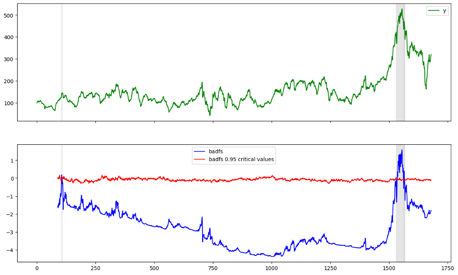

``` python
psy_obj = PSY_GSADF(data_psy, njit=True)
gsadf, bsadfs = psy_obj.stats()
cv_gsadf, cv_bsadfs = psy_obj.critical_values(m=500)
psy_obj.plot()
```

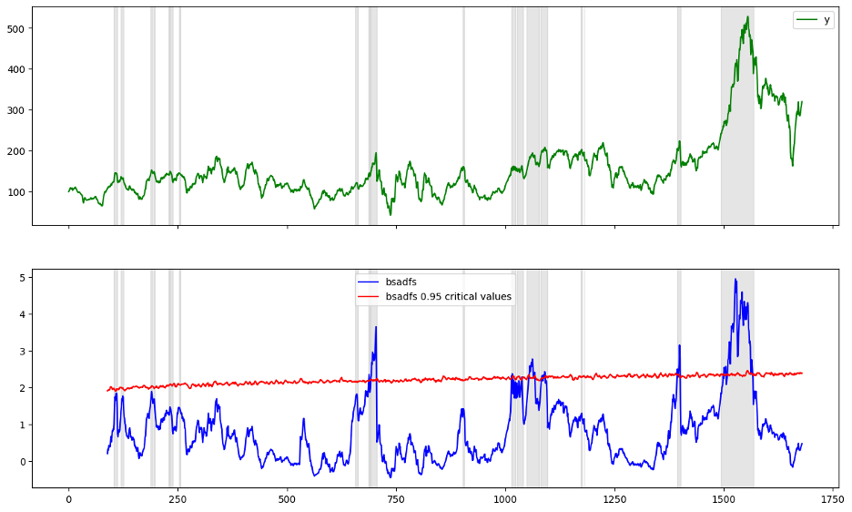

## 3. The WHL Test

The detection of financial bubbles and crashes is critical for
mitigating economic damage. Whitehouse, Harvey, and Leybourne (2022)
propose real-time monitoring procedures to detect such phenomena. This
document focuses on the calculation of two key statistics: $A_{(e,m)}$
and $S_{(e,m,n)}$, which are integral to identifying explosive and
stationary regimes in time series data.

The $A_{(e,m)}$ statistic is employed to detect an explosive regime
within a time series. It is based on the Taylor series expansion of the
first differences during the explosive regime and tests for the presence
of an upward trend in these differences. Let $k$ denote the window width
over which the statistic is computed and $e$ the last observation used.
The $A_{(e,m)}$ statistic is given by:

$$A(e,k) = \frac{\sum_{t = e - k + 1}^{e}{(t - e + k)\Delta y_{t}}}{\sqrt{\sum_{t = e - k + 1}^{e}{(t - e + k)\Delta y_{t}}^{2}}},$$

where $\Delta y_{t}$ represents the first differences of the time
series $y_{t}$.

In practice, the $A_{(e,m)}$ statistic is computed over rolling
sub-samples of length $k$ within an initial training sample. The maximum
of these training sample statistics forms the critical value
$A_{max,train}$:

$$A_{max,train} = \max_{e \in \lbrack k + 1,T\rbrack}{A(e,k)},$$

where $T$ is the length of the training sample. Monitoring for an
explosive regime begins at time $t\  = \ T\  + \ k$, and detection
occurs if:

$$A(t,k) > A_{max,train}$$

The $S(e,m,n)$ statistic is used to detect the transition from an
explosive regime to a stationary collapse regime. It leverages the
differing signs of the means of the first differences in the explosive
and stationary processes. Specifically, it assesses the product of these
means over two sub-samples around the suspected transition point.

Consider the model expressed in the first differences near the endpoint
of the explosive regime:

$$\mathrm{\Delta}y_{t} = \left\lbrace \begin{array}{r}
\beta_{1} + \varepsilon_{t}\ for\ t \in \left\lbrack \tau_{2}T - m + 1,\ \ \ \tau_{2}T \right\rbrack \\
\beta_{2} + \varepsilon_{t}\ for\ t \in \left\lbrack \tau_{2}T + 1,\ \ \ \tau_{2}T + n \right\rbrack
\end{array} \right.$$

Here, $\beta_{1}$ and $\beta_{2}$ are the means of the first
differences before and after the transition, respectively. The statistic
is then given by:

$$S(e,m,n) = \frac{1}{m}\sum_{t = e - n - m + 1}^{e - n}{\Delta y_{t}} \cdot \frac{1}{n}\sum_{t = e - n + 1}^{e}{\Delta y_{t}}$$

This statistic is standardized to account for possible variance changes,
resulting in:

$$S(e,m,n) = \frac{\left( \sum_{t = e - n - m + 1}^{e - n}{\Delta y_{t}} \right) \cdot \left( \sum_{t = e - n + 1}^{e}{\Delta y_{t}} \right)}{\left( \sum_{t = e - n - m + 1}^{e - n}{\Delta y_{t}^{2}} \right)^{1\text{/}2} \cdot \left( \sum_{t = e - n + 1}^{e}{\Delta y_{t}^{2}} \right)^{1\text{/}2}}$$

The critical value for this statistic, $S_{min,train}$, is the minimum
of the training sample statistics:

$$S_{min,train} = \min_{e \in \lbrack T - m - n + 1,T\rbrack}S(e,m,n)$$

Monitoring for a stationary collapse begins after the detection of an
explosive regime. A collapse is detected if:

$$S(e,m,n) < S_{min,\text{train}}$$

Whitehouse et al. demonstrate the efficacy of these statistics through
simulations and empirical application to the US housing market. The
$A(e,m)$ statistic effectively detects bubbles, while the $S(e,m,n)$
statistic identifies subsequent crashes. The flexibility of these
procedures, particularly the user-chosen parameters m and n, allows
practitioners to balance between rapid detection and false positive
rates.

The $A(e,m)$ and $S(e,m,n)$ statistics provide robust tools for
real-time monitoring of bubbles and crashes in financial time series.
Their implementation, leveraging training samples for calibration,
ensures both sensitivity and specificity in detecting critical regime
changes, thereby aiding policymakers in timely interventions. To
calculate $A(e,m)$ and $S(e,m,n)$ indices, we need to determine $m$ and
$n$ values. We use $m = 10$ and $n = 2$ as the authors suggest that they
will be suitable for many scenarios.

Overall, while both sets of indicators aim to identify bubble periods,
the PSY indicators provide a more stable and gradual representation,
potentially capturing longer-term bubble dynamics. The WHL indicators,
with their high volatility, seem to be more responsive to short-term
market movements. The choice between these methods may depend on whether
the focus is on capturing broad, sustained bubbles or detecting
frequent, short-term deviations.

``` python
whl_obj = WHL(data_whl['Value'])
whl_obj.plot()
```

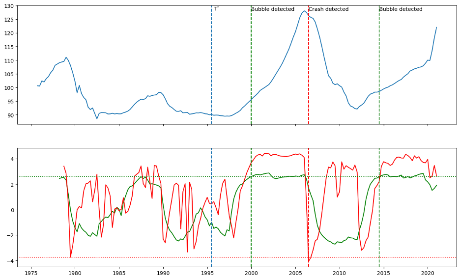

## 4. House Search Index (HSI)

In the following, we construct multiple versions of the House Search
Index (HSI) and select the best one to use as an exogenous variable in
the forecasting model. In this regard, we get 30 relevant search query
data from Google Trends. They include those suggested by Moller et al.
(2023) and what can be obtained by following the paper\'s approach for
Canada. The data contains monthly observations from 2004-01 to 2023-11.
We only use data until 2019-12 to preprocess the data and train the
model.

Some of the related terms may have more noise in their measurement than
others. To eliminate the noise and more precisely estimate latent
demand, Moller et al. (2023) employ a targeted principal component
analysis (PCA) method that ensures only the most relevant search indices
are included in calculating the latent demand factor. Specifically,
their approach follows Bai and Ng (2008) as they use the elastic net
estimator of Zou and Hastie (2005) to select the 10 most relevant search
indices and then apply principal component analysis to summarize the
most important information from these indices into one common component.
Moller et al. (2023) interpret this principal component as a summary
measure for housing search and refer to it as the HSI.

Moller et al. (2023) admit their main goal is to produce a simple and
easy-to-interpret index of housing search, which is why they used a
simple targeted PCA approach. Moreover, they claim the predictive
results that they reported are generally highly robust to using more
advanced machine learning techniques. Like Moller et al. (2023), we
adopt the targeted principal component analysis (PCA) method to
calculate the HSI. While Moller et al. (2023) construct one HSI, we
construct various potential HSIs from different lags and combinations of
the Google Trend series and select the best HSI for forecasting
purposes.

To find the best HSI, we take the following steps: First, we preprocess
Google Trends search volume data and the HPI, including removing
seasonal and trend factors. Second, we compute several HSIs by
extracting the first principal component of search indices volumes.
Third, we find the best lags for each HSI in the forecasting model using
information criteria BIC. Finally, we pick the best HSI based on the
cross-validation MSE in the forecasting model over the training sample.

### 4.1 Preprocess HPI

We first convert the HPI series to its natural logarithm to study its
proportional changes. It is well-known that house prices display strong
seasonal variation, with high prices during spring and summer and low
prices during fall and winter. Furthermore, we remove seasonality and
trend by regressing each series on monthly dummy variables and a linear
time trend factor. Then, we study the residuals from this regression.

$$(2)\ \ \ \ \ Y_{t} = c\  + \ \alpha*t + \sum_{i = 1}^{12}{\beta_{i}*d_{it}} + \varepsilon_{t}\ \overset{\ \ \ \ \ \ \ \ \ \ \ \ \ \ \ \ \ }{\rightarrow}\ Y_{t}^{new}\  = \ \varepsilon_{t}$$

### 4.2 Preprocess Google Trends Data

We transform the search indices as follows: First, to comply with
changes in the HPI, we remove seasonality and trend in the same way.

$$(3)\ \ \ \ X_{t} = c\  + \ \alpha*t + \sum_{i = 1}^{12}{\beta_{i}*d_{it}} + \varepsilon_{t}\ \overset{\ \ \ \ \ \ \ \ \ \ \ \ \ \ \ \ \ }{\rightarrow}\ X_{t}^{'}\  = \ \varepsilon_{t}$$

While HPI varies over time, search volume data are very volatile. To
address this issue, we smooth search volumes by converting them into
their 12-month moving average.

$$(4)\ \ \ \ \ X_{t}^{new}\  = \ 1/12\ *\sum_{i = 0}^{11}{X'}_{t - i}$$

**Google Trends Preprocessing Graphs for h=12**

```python
GT_object = GoogleTrend(relevant_df, '2019-12-31', verbose=1, seed=1, pca_lag=True)
GT_object.prepare_gtrends(detrend=True, deseasonal=True, method='reg', regression='ct', log=False, smooth=12)
GT_object.prepare_hpi(detrend=True, deseasonal=True, method='reg', regression='ct', log=True)
GT_object.plot_gtrends()
```

Before any preprocessing
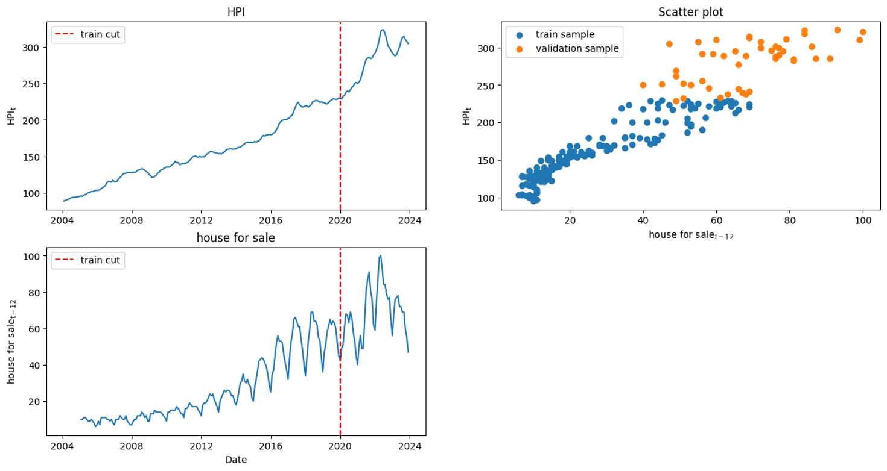

After preprocessing "house for sale" search volume and before preprocessing HPI
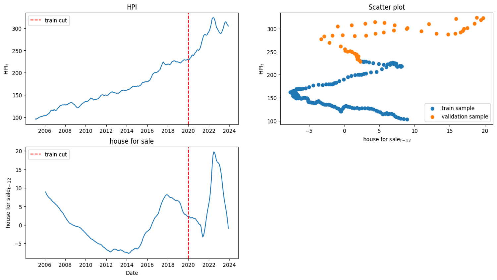

After preprocessing "house for sale" search volume and HPI


### 4.3 Compute the House Search Index (HSI)

Computing HSIs consists of several steps and multiple layers. We
constitute a pool of input data, naming it $A_{k}$ in layer $k$. We
initiate $A_{1}$ as a set of all search indices and their lags up to 3
months. This allows us to match search indices with different lags since
a typical home buyer searches for different queries at different times
before buying a home.

In layer k, we adopt the following procedure. First, for each forecast
horizon h, we try to predict HPI by regressing HPI on each series $X$ in
$A_{k}$. Then, we compute the cross-validation MSE over the training
sample. In this regard, we shuffle data and compute the 5-fold
cross-validation MSE equation (5). Because lagged values are treated as
distinct independent variables, shuffling the time series does not
disrupt the lag relationship at each individual estimation point in the
autoregressive model. We repeat this procedure 20 times and then take
the average MSE and call it ${CV}_{ih}$.

$$(5)\ \ \ \ \ \ \ Y_{t + h}\  = \ c + \beta*X_{t} + \varepsilon_{t + h}$$

Second, for each forecast horizon $h$, we assign a weight ($W_{ihk}$) to
each series $i$ in $A_{k}$ based on its cross-validation MSE
(${CV}_{ih}$). The weights are different for each forecast horizon and
are computed as follows.

$$(6)\ \ \ \ \ W_{ihk} = \ \frac{\left( \frac{1}{{CV}\_{ih}} \right)^{4}}{\sum_{i \in A_{k}}^{}\left( \frac{1}{{CV}_{ih}} \right)^{4}}$$

Third, for each forecast horizon $h$, we pick 10 series from $A_{k}$
using a weighted random draw ($W_{ihk}$). To avoid combining different
lags of one search index to make a new HSI, we only consider the one
with the lowest cross-validation MSE (${CV}_{ih}$) from different lags
of a search index. Then, we compute the HSI by calculating the first
principal component of these 10 series. We repeat the selection and
compute the new HSI 60 times for each forecast horizon. So, we would
have 60 HSIs for each forecasting horizon and 240 HSIs at all.

### 4.4 Repeat Step 4.3

Finally, we check if the minimum ${CV}\_{ih}$ for $i$ in $A_{k}$ is lower
than that for $i$ in $A_{k - 1}$ for all forecast horizons. If so, we
make $A_{k + 1}$ by adding 240 new HSIs to $A_{k}$ and then start a
layer $k + 1$. Otherwise, we stop generating new HSIs and proceed to the
next step. In layer $k = 1$, new HSIs are built only from the search
indices, but in layers $k\  \geq \ 2$, new HSIs are built from the
search indices and old HSIs that are constructed in previous layers.

After we finish creating HSIs, we define a set of best candidate
predictors for each forecast horizon. In this regard, we constitute a
set $B_{h}$ by picking 240 series from $A_{k}$ in the last layer with
the lowest ${CV}\_{ih}$ for each forecast horizon $h$. From now on, we
will only work with $B_{h}$ sets, and we won\'t need $A_{k}$.

### 4.5 Find the Optimal Lag Structure

To select the best predictor to use in the forecasting model, we first
need to specify the lags in the forecasting model (1). We find the best
combination of HPI lags and HSI lags by Bayesian Information Criterion
(BIC) for each candidate predictor in $B_{h}$. The lags are considered
consecutively, and the maximum lag is 3.

### 4.6 Select the Best HSI

After specifying the lags of each predictor of $B_{h}$ in equation (1),
we find the best predictor for forecasting purposes based on
cross-validation MSE in the forecasting model. So, like before, we
shuffle data and compute the 5-fold cross-validation MSE 20 times, but
this time in the forecasting model (1) rather than equation (5). These
cross-validation MSEs are in the complete setup of the forecasting model
with the lags of HPI and the predictor. Then, we take the average of 20
MSE and compute the mean MSE. Finally, we calculate the ultimate HSI for
each horizon by computing the first PC of 10 HSI that have the lowest
mean MSE in their full setup forecasting model.

Although each HSI is intended for a specific horizon, we consider all
candidate HSIs and search indices in $B_{h}$ for each forecasting
horizon h. So, one of the search indices may be selected as the best
predictor.

The process of creating UHSIs
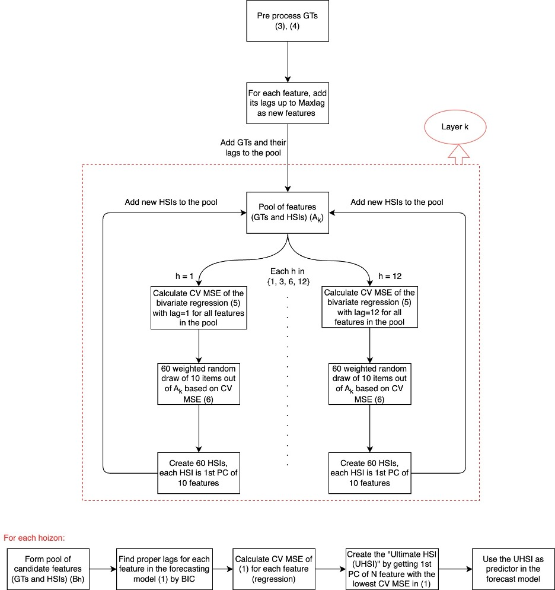

This flowchart illustrates the process of generating Ultimate Housing
Search Indices (UHSIs) and their integration into the forecasting model.
The process begins with the preprocessing of Google Trends (GTs) data,
followed by the addition of lagged features to the pool. HSIs are then
created through weighted random draws from the pool of GTs and their
lags, followed by bivariate regression across multiple forecast horizons
(h = 1, 3, 6, 12). The HSIs are generated as the first principal
component of the selected features. Layers are iteratively added to the
procedure until the minimum cross-validated (CV) error of the HSIs in
the most recent layer begins to increase, indicating the optimal depth
of the model. Finally, the \"Ultimate HSI\" (UHSI) is derived from a set
of best HSIs for each horizon h (B~h~) and used as a predictor in the
final forecasting model.

**Forecasting by UHSIs Graphs**

``` python
GT_object.compute_hsi(layer=1, input_pool=True, auto_layer=False, n_input=10, n_hsi=20, max_lag=3, random='rnd', var_select='CV', selection_h_list=[0,1,3,6,12])
GT_object.compute_hsi(layer=2, input_pool=True, auto_layer=True, n_input=10, n_hsi=20, max_lag=1, random='rnd', var_select='CV', selection_h_list=[0,1,3,6,12])
GT_object.lag_setting(lag_select='IC')
GT_object.forecast(h_list=[1,3,6,12], seasonal=True, hsi_CV_select=True, fit_intercept=True, cv=5, n_iter=20, original_scale=False)
GT_object.plot_forecast('UHSI_1')
```
Foreast by UHSI_1
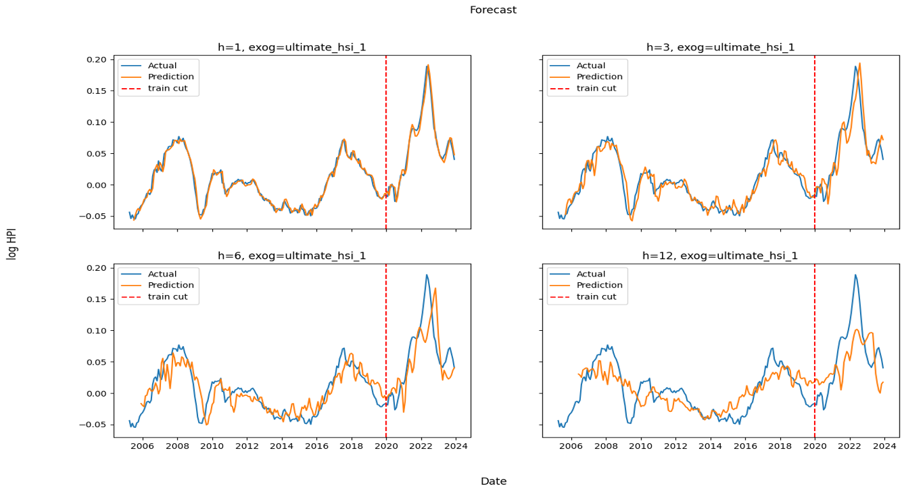

``` python
GT_object.plot_forecast('UHSI_3')
```
Foreast by UHSI_3
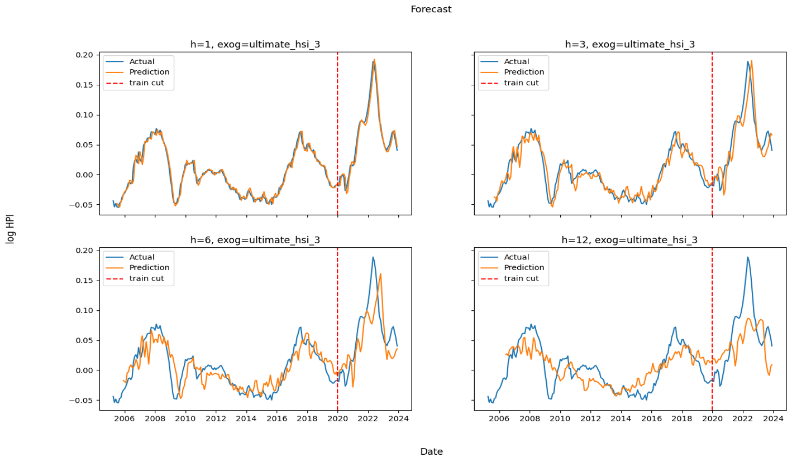

``` python
GT_object.plot_forecast('UHSI_6')
```
Foreast by UHSI_6
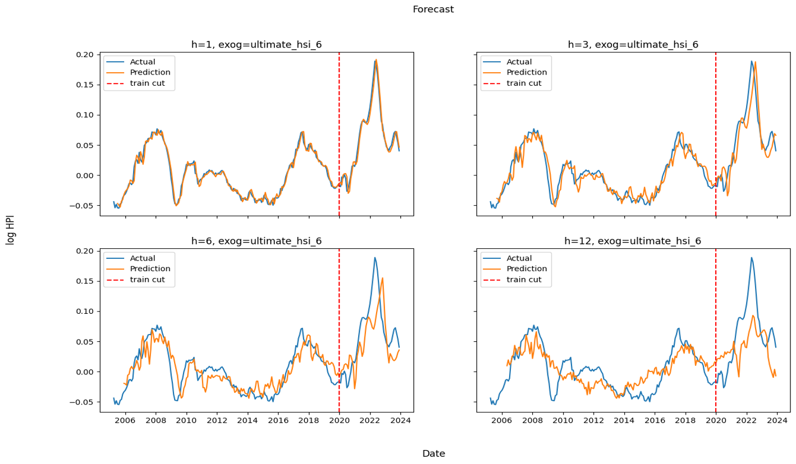

``` python
GT_object.plot_forecast('UHSI_12')
```
Foreast by UHSI_12


## 5. Statistical Tests

To assess the forecast accuracy and encompassing ability of competing
models, we employ the Modified Diebold-Mariano (MDM) statistic developed
by Harvey, Leybourne, and Newbold (1998). The MDM test, an extension of
the original Diebold-Mariano (DM) test, is particularly suited for
comparing the predictive accuracy of two competing forecasts, allowing
for adjustments in finite sample distributions. This methodology ensures
a robust comparison by considering the potential autocorrelation and
heteroskedasticity in forecast errors.

The following steps outline the process: First, we generate
out-of-sample forecasts from two competing models, $M_{A}$​ and $M_{B}$​​,
for the variable of interest (e.g., housing prices). We ensure that the
forecasts cover the same time horizon. The errors of the two models are
calculated as $e_{t}^{A}$ and $e_{t}^{B}$.​​ Then, for the null hypothesis
$\text{H}\_{\text{0,1}}$ that model $M_{A}$​ and model $M_{B}$ both have
the same MAFE ​we calculate $d_{t}$ as follows:

$d_{t} = \left| e_{t}^{A} \right| - \left| e_{t}^{B} \right|$​​​​​

Similarly, for the null hypothesis $\text{H}\_{\text{0,2}}$ that model
$M_{A}$​ and model $M_{B}$ both have the same MSFE ​we calculate $d_{t}$
as follows:

$d_{t} = {(e_{t}^{A})}^{2} - {(e_{t}^{B})}^{2}$​​​

Finally, for the null hypothesis $\text{H}\_{\text{0,3}}$ that model
$M_{A}$​ forecast encompasses model $M_{B}$, ​we calculate $d_{t}$ as
follows:

$d_{t} = (e_{t}^{A} - e_{t}^{B})e_{t}^{A}$​​​​​

The test statistic MDM is then defined as:

$$\overline{d} \equiv \tau^{- 1} \cdot \sum_{t = T + 1}^{T + \tau}d_{t}$$

$$\sigma_{d} \equiv \tau^{- 1}\sqrt{\sum_{j = - (h - 1)}^{h - 1}{\sum_{t = |j| + T + 1}^{T + \tau}d_{t}} \cdot d_{t - |j|}}$$

$$DM \equiv \frac{\overline{d}}{\sigma_{d}}$$

$$MDM \equiv DM \cdot \sqrt{\frac{\tau + 1 - 2 \cdot h + h \cdot (h - 1)\text{/}\tau}{\tau}}$$

where h is the forecast horizon, $\tau$ is the number of forecasts, T
is the length of the estimation sample, $\sigma_{d}$ is the standard
deviation of d, and DM is the Diebold-Mariano statistic. MDM here
follows $t(\tau - 1)$ distribution.

# 6. UHSIs Robustness to Keyword Selection

We evaluate the forecasting power of the selected predictors. We
establish an autoregressive model without any exogenous variables as the
base model. Then, we assess the impact of incorporating UHSIs derived
from Google Trends into the base model. These indices are based on the
HSI introduced by Moller et al. (2023), who demonstrated that HSI
effectively forecasts detrended and deseasonalized HPI. Accordingly, we
apply the same preprocessing techniques to HPI in the third section.

We also report Mean Absolute Forecast Error (MAFE) and Mean Squared
Forecast Error (MSFE) for all forecast models. Subsequently, we quantify
the improvement in MAFE or MSFE achieved by the forecast model with
predictors expressed as a percentage relative to the base model.
Additionally, we employ the Modified Diebold-Mariano (MDM) test to
compare all forecasting models against the base model, testing various
null hypotheses, and we report the corresponding p-values. The null
hypotheses are as follows.

$\text{H}_{\text{0,1}}$: Both the model with external predictor and the
base model have equal MAFE

$\text{H}_{\text{0,2}}$: Both the model with external predictor and the
base model have equal MSFE

$\text{H}_{\text{0,3}}$: The model with external predictor
forecast-encompasses the base model

Google Trends data are available from January 2004, and our data spans
from January 2004 to November 2023. We used data until the end of 2019
to estimate the model and from January 2020 to November 2023 to
calculate forecasting measurements like MAFE and MSFE. To find the lags
for the predictors on the right side of the forecasting model, we
consider all combinations of HPI and exogenous variable consecutive lags
and choose $m$ and $n$ based on Bayesian Information Criterion (BIC). We
have one *UHSI* constructed for each forecast horizon, but we perform
predictions using each for each forecast horizon. The following tables
report the lags set selected for HPI and HSIs, MAFE, MSFE, MAFE
improvement, MSFE improvement, and p-values for all the null hypotheses.

First, we start forecasting with a set named G1 which is a set of search
queries relevant to the real estate market that a typical homebuyer uses
while searching for a home, representing the market demand. Second, to
check whether the results are reliable, we repeat the forecasting using
a set of irrelevant keywords called G2 and examine how the new results
are different. Finally, we investigate the HSI algorithm\'s performance
in picking the most informative search data. In this regard, we combine
all relevant and irrelevant keywords and use them to generate HSIs for
forecasting. We call the last set G3.

### 6.1 Relevant Keywords

```python
G1_rel = GoogleTrend(relevant_df, '2019-12-31', verbose=1, seed=1, pca_lag=True)
G1_rel.prepare_gtrends(detrend=True, deseasonal=True, method='reg', regression='ct', log=False, smooth=12)
G1_rel.prepare_hpi(detrend=True, deseasonal=True, method='reg', regression='ct', log=True)
G1_rel.compute_hsi(layer=1, input_pool=True, auto_layer=False, n_input=10, n_hsi=20, max_lag=3, random='rnd', var_select='CV', selection_h_list=[0,1,3,6,12])
G1_rel.compute_hsi(layer=2, input_pool=True, auto_layer=True, n_input=10, n_hsi=20, max_lag=1, random='rnd', var_select='CV', selection_h_list=[0,1,3,6,12])
G1_rel.lag_setting(lag_select='IC')
G1_rel.forecast(h_list=[1,3,6,12], seasonal=True, hsi_CV_select=True, fit_intercept=True, cv=5, n_iter=20, original_scale=False)
G1_rel.results(results_table=True, head=True)
```

<table>
<caption><p>Table 1: Forecast by UHSIs using relevant
keywords</p></caption>
<colgroup>
<col style="width: 9%" />
<col style="width: 10%" />
<col style="width: 4%" />
<col style="width: 3%" />
<col style="width: 9%" />
<col style="width: 9%" />
<col style="width: 14%" />
<col style="width: 14%" />
<col style="width: 8%" />
<col style="width: 8%" />
<col style="width: 8%" />
</colgroup>
<thead>
<tr>
<th rowspan="2"
style="text-align: center;"><p><strong>Forecast</strong></p>
<p><strong>Horizon</strong></p></th>
<th rowspan="2"
style="text-align: center;"><strong>Predictor</strong></th>
<th rowspan="2" style="text-align: center;"><strong>m</strong></th>
<th rowspan="2" style="text-align: center;"><strong>n</strong></th>
<th rowspan="2" style="text-align: center;"><strong>MAFE</strong></th>
<th rowspan="2" style="text-align: center;"><strong>MSFE</strong></th>
<th rowspan="2" style="text-align: center;"><p><strong>MAFE</strong></p>
<p><strong>Improvement</strong></p></th>
<th rowspan="2" style="text-align: center;"><p><strong>MSFE</strong></p>
<p><strong>Improvement</strong></p></th>
<th colspan="3"
style="text-align: center;"><strong>p-value</strong></th>
</tr>
<tr>
<th style="text-align: center;"><span
class="math display">H<sub>0,1</sub></span></th>
<th style="text-align: center;"><span
class="math display">H<sub>0,2</sub></span></th>
<th style="text-align: center;"><span
class="math display">H<sub>0,3</sub></span></th>
</tr>
</thead>
<tbody>
<tr>
<td rowspan="5" style="text-align: center;"><strong>h=1</strong></td>
<td style="text-align: center;"><strong>None</strong></td>
<td style="text-align: center;">3</td>
<td style="text-align: center;">0</td>
<td style="text-align: center;">0.00850</td>
<td style="text-align: center;">0.00010</td>
<td style="text-align: center;">--</td>
<td style="text-align: center;">--</td>
<td style="text-align: center;">--</td>
<td style="text-align: center;">--</td>
<td style="text-align: center;">--</td>
</tr>
<tr>
<td style="text-align: center;"><strong>UHSI_1</strong></td>
<td style="text-align: center;">3</td>
<td style="text-align: center;">3</td>
<td style="text-align: center;">0.00825</td>
<td style="text-align: center;">0.00009</td>
<td style="text-align: center;">2.9%</td>
<td style="text-align: center;">12.7%</td>
<td style="text-align: center;">0.6684</td>
<td style="text-align: center;">0.2044</td>
<td style="text-align: center;">0.3378</td>
</tr>
<tr>
<td style="text-align: center;"><strong>UHSI_3</strong></td>
<td style="text-align: center;">3</td>
<td style="text-align: center;">1</td>
<td style="text-align: center;">0.00812</td>
<td style="text-align: center;">0.00009</td>
<td style="text-align: center;">4.5%</td>
<td style="text-align: center;">9.8%</td>
<td style="text-align: center;">0.0782</td>
<td style="text-align: center;">0.0162</td>
<td style="text-align: center;">0.0474</td>
</tr>
<tr>
<td style="text-align: center;"><strong>UHSI_6</strong></td>
<td style="text-align: center;">3</td>
<td style="text-align: center;">1</td>
<td style="text-align: center;">0.00813</td>
<td style="text-align: center;">0.00009</td>
<td style="text-align: center;">4.3%</td>
<td style="text-align: center;">9.3%</td>
<td style="text-align: center;">0.0814</td>
<td style="text-align: center;">0.0190</td>
<td style="text-align: center;">0.0517</td>
</tr>
<tr>
<td style="text-align: center;"><strong>UHSI_12</strong></td>
<td style="text-align: center;">3</td>
<td style="text-align: center;">0</td>
<td style="text-align: center;">0.00850</td>
<td style="text-align: center;">0.00010</td>
<td style="text-align: center;">--</td>
<td style="text-align: center;">--</td>
<td style="text-align: center;">--</td>
<td style="text-align: center;">--</td>
<td style="text-align: center;">--</td>
</tr>
<tr>
<td rowspan="5" style="text-align: center;"><strong>h=3</strong></td>
<td style="text-align: center;"><strong>None</strong></td>
<td style="text-align: center;">3</td>
<td style="text-align: center;">0</td>
<td style="text-align: center;">0.02292</td>
<td style="text-align: center;">0.00082</td>
<td style="text-align: center;">--</td>
<td style="text-align: center;">--</td>
<td style="text-align: center;">--</td>
<td style="text-align: center;">--</td>
<td style="text-align: center;">--</td>
</tr>
<tr>
<td style="text-align: center;"><strong>UHSI_1</strong></td>
<td style="text-align: center;">3</td>
<td style="text-align: center;">3</td>
<td style="text-align: center;">0.02061</td>
<td style="text-align: center;">0.00063</td>
<td style="text-align: center;">10.1%</td>
<td style="text-align: center;">23.1%</td>
<td style="text-align: center;">0.4451</td>
<td style="text-align: center;">0.2999</td>
<td style="text-align: center;">0.5129</td>
</tr>
<tr>
<td style="text-align: center;"><strong>UHSI_3</strong></td>
<td style="text-align: center;">3</td>
<td style="text-align: center;">3</td>
<td style="text-align: center;">0.02088</td>
<td style="text-align: center;">0.00064</td>
<td style="text-align: center;">8.9%</td>
<td style="text-align: center;">21.4%</td>
<td style="text-align: center;">0.4952</td>
<td style="text-align: center;">0.3325</td>
<td style="text-align: center;">0.5867</td>
</tr>
<tr>
<td style="text-align: center;"><strong>UHSI_6</strong></td>
<td style="text-align: center;">3</td>
<td style="text-align: center;">1</td>
<td style="text-align: center;">0.02131</td>
<td style="text-align: center;">0.00070</td>
<td style="text-align: center;">7.0%</td>
<td style="text-align: center;">14.1%</td>
<td style="text-align: center;">0.2896</td>
<td style="text-align: center;">0.1956</td>
<td style="text-align: center;">0.2725</td>
</tr>
<tr>
<td style="text-align: center;"><strong>UHSI_12</strong></td>
<td style="text-align: center;">3</td>
<td style="text-align: center;">1</td>
<td style="text-align: center;">0.02089</td>
<td style="text-align: center;">0.00067</td>
<td style="text-align: center;">8.9%</td>
<td style="text-align: center;">17.5%</td>
<td style="text-align: center;">0.2977</td>
<td style="text-align: center;">0.1969</td>
<td style="text-align: center;">0.2878</td>
</tr>
<tr>
<td rowspan="5" style="text-align: center;"><strong>h=6</strong></td>
<td style="text-align: center;"><strong>None</strong></td>
<td style="text-align: center;">3</td>
<td style="text-align: center;">0</td>
<td style="text-align: center;">0.03862</td>
<td style="text-align: center;">0.00240</td>
<td style="text-align: center;">--</td>
<td style="text-align: center;">--</td>
<td style="text-align: center;">--</td>
<td style="text-align: center;">--</td>
<td style="text-align: center;">--</td>
</tr>
<tr>
<td style="text-align: center;"><strong>UHSI_1</strong></td>
<td style="text-align: center;">3</td>
<td style="text-align: center;">1</td>
<td style="text-align: center;">0.03065</td>
<td style="text-align: center;">0.00158</td>
<td style="text-align: center;">20.7%</td>
<td style="text-align: center;">34.1%</td>
<td style="text-align: center;">0.3136</td>
<td style="text-align: center;">0.3540</td>
<td style="text-align: center;">0.4495</td>
</tr>
<tr>
<td style="text-align: center;"><strong>UHSI_3</strong></td>
<td style="text-align: center;">3</td>
<td style="text-align: center;">1</td>
<td style="text-align: center;">0.03040</td>
<td style="text-align: center;">0.00155</td>
<td style="text-align: center;">21.3%</td>
<td style="text-align: center;">35.5%</td>
<td style="text-align: center;">0.3156</td>
<td style="text-align: center;">0.3454</td>
<td style="text-align: center;">0.4458</td>
</tr>
<tr>
<td style="text-align: center;"><strong>UHSI_6</strong></td>
<td style="text-align: center;">3</td>
<td style="text-align: center;">1</td>
<td style="text-align: center;">0.03388</td>
<td style="text-align: center;">0.00180</td>
<td style="text-align: center;">12.3%</td>
<td style="text-align: center;">25.1%</td>
<td style="text-align: center;">0.4149</td>
<td style="text-align: center;">0.3334</td>
<td style="text-align: center;">0.4259</td>
</tr>
<tr>
<td style="text-align: center;"><strong>UHSI_12</strong></td>
<td style="text-align: center;">3</td>
<td style="text-align: center;">1</td>
<td style="text-align: center;">0.03114</td>
<td style="text-align: center;">0.00160</td>
<td style="text-align: center;">19.4%</td>
<td style="text-align: center;">33.2%</td>
<td style="text-align: center;">0.3231</td>
<td style="text-align: center;">0.3353</td>
<td style="text-align: center;">0.4257</td>
</tr>
<tr>
<td rowspan="5" style="text-align: center;"><strong>h=12</strong></td>
<td style="text-align: center;"><strong>None</strong></td>
<td style="text-align: center;">3</td>
<td style="text-align: center;">0</td>
<td style="text-align: center;">0.05580</td>
<td style="text-align: center;">0.00488</td>
<td style="text-align: center;">--</td>
<td style="text-align: center;">--</td>
<td style="text-align: center;">--</td>
<td style="text-align: center;">--</td>
<td style="text-align: center;">--</td>
</tr>
<tr>
<td style="text-align: center;"><strong>UHSI_1</strong></td>
<td style="text-align: center;">3</td>
<td style="text-align: center;">1</td>
<td style="text-align: center;">0.03981</td>
<td style="text-align: center;">0.00206</td>
<td style="text-align: center;">28.7%</td>
<td style="text-align: center;">57.8%</td>
<td style="text-align: center;">0.5903</td>
<td style="text-align: center;">0.5231</td>
<td style="text-align: center;">0.6550</td>
</tr>
<tr>
<td style="text-align: center;"><strong>UHSI_3</strong></td>
<td style="text-align: center;">3</td>
<td style="text-align: center;">1</td>
<td style="text-align: center;">0.03982</td>
<td style="text-align: center;">0.00207</td>
<td style="text-align: center;">28.6%</td>
<td style="text-align: center;">57.6%</td>
<td style="text-align: center;">0.5879</td>
<td style="text-align: center;">0.5193</td>
<td style="text-align: center;">0.6546</td>
</tr>
<tr>
<td style="text-align: center;"><strong>UHSI_6</strong></td>
<td style="text-align: center;">3</td>
<td style="text-align: center;">1</td>
<td style="text-align: center;">0.04693</td>
<td style="text-align: center;">0.00311</td>
<td style="text-align: center;">15.9%</td>
<td style="text-align: center;">36.2%</td>
<td style="text-align: center;">0.6471</td>
<td style="text-align: center;">0.5287</td>
<td style="text-align: center;">0.6594</td>
</tr>
<tr>
<td style="text-align: center;"><strong>UHSI_12</strong></td>
<td style="text-align: center;">3</td>
<td style="text-align: center;">1</td>
<td style="text-align: center;">0.04121</td>
<td style="text-align: center;">0.00223</td>
<td style="text-align: center;">26.1%</td>
<td style="text-align: center;">54.2%</td>
<td style="text-align: center;">0.5914</td>
<td style="text-align: center;">0.5158</td>
<td style="text-align: center;">0.6426</td>
</tr>
</tbody>
</table>

. This table reports the optimal number of lags (m, n), MAFE, and MSFE
for predicting the logarithm of HPI adjusted for seasonality and time
trends in Canada using autoregressive models. The models evaluated
include a base model with no external predictors and several models that
incorporate different UHSIs driven from relevant keywords search data as
external predictors. Additionally, the table shows the percentage
improvement in forecast accuracy (MAFE and MSFE) of the models with
UHSIs relative to the base model. The p-values associated with the null
hypotheses test whether the inclusion of each UHSI significantly
improves the model\'s forecasting performance compared to the base
model. $\text{H}\_{\text{0,1}}$: equal MAFE, $\text{H}\_{\text{0,2}}$:
equal MSFE, $\text{H}_{\text{0,3}}$: the predictor model encompasses the
base model.

We employ the Bayesian Information Criterion (BIC) to determine the best
lag structure. However, the selection process indicated that no lag was
optimal for UHSI_12 in $h = 1$. In other words, we found that the
optimal value of $n$ in the forecast model is $0$ for UHSI_12 in $h = 1$
and the forecast models became the base model. Consequently, we did not
perform forecasting performance tests for these specific cases.

As demonstrated in the tables, HSIs provide greater predictive
improvements over extended periods. While the MAFE and MSFE improvement
increases by longer horizons, the p-values of null hypotheses of equal
MAFE or MSFE increase too. This means that we can only reject some null
hypotheses at the 0.05 and 0.1 significance levels in $h = 1$ and any
null hypotheses in $h = 3,\ 6,\ 12$ cannot be rejected at the 0.15
significance level. The forecasting graphs are in the Appendix.

### 6.2 Irrelevant Keywords

The data we used so far to generate HSIs were search frequencies for a
set of relevant keywords typically used by individuals seeking homes.
The accuracy of the predictions was notably high, suggesting a strong
correlation between search trends and real estate market movements. To
validate the reliability of these results, a comparative analysis was
conducted using predictions based on irrelevant keywords. This approach
aimed to assess whether the predictive accuracy observed with the
relevant keywords was genuinely indicative of market dynamics or merely
coincidental.

For the forecast horizon $h = 1$, the optimal value of $n$ for all UHSIs
is 0, resulting in the forecast model reducing to the base model. The
results for other forecast horizons are provided in comparable tables
below.

``` python
G2_irr = GoogleTrend(irrelevant_df, '2019-12-31', verbose=1, seed=1, pca_lag=True)
G2_irr.prepare_gtrends(detrend=True, deseasonal=True, method='reg', regression='ct', log=False, smooth=12)
G2_irr.prepare_hpi(detrend=True, deseasonal=True, method='reg', regression='ct', log=True)
G2_irr.compute_hsi(layer=1, input_pool=True, auto_layer=False, n_input=10, n_hsi=20, max_lag=3, random='rnd', var_select='CV', selection_h_list=[0,1,3,6,12])
G2_irr.compute_hsi(layer=2, input_pool=True, auto_layer=True, n_input=10, n_hsi=20, max_lag=1, random='rnd', var_select='CV', selection_h_list=[0,1,3,6,12])
G2_irr.lag_setting(lag_select='IC')
G2_irr.forecast(h_list=[1,3,6,12], seasonal=True, hsi_CV_select=True, fit_intercept=True, cv=5, n_iter=20, original_scale=False)
G2_irr.results(results_table=True, head=True)
```

<table>
<caption><p>Table 2: Forecast by UHSIs using irrelevant
keywords</p></caption>
<colgroup>
<col style="width: 10%" />
<col style="width: 10%" />
<col style="width: 4%" />
<col style="width: 3%" />
<col style="width: 9%" />
<col style="width: 9%" />
<col style="width: 14%" />
<col style="width: 14%" />
<col style="width: 8%" />
<col style="width: 8%" />
<col style="width: 8%" />
</colgroup>
<thead>
<tr>
<th rowspan="2"
style="text-align: center;"><p><strong>Forecast</strong></p>
<p><strong>Horizon</strong></p></th>
<th rowspan="2"
style="text-align: center;"><strong>Predictor</strong></th>
<th rowspan="2" style="text-align: center;"><strong>m</strong></th>
<th rowspan="2" style="text-align: center;"><strong>n</strong></th>
<th rowspan="2" style="text-align: center;"><strong>MAFE</strong></th>
<th rowspan="2" style="text-align: center;"><strong>MSFE</strong></th>
<th rowspan="2" style="text-align: center;"><p><strong>MAFE</strong></p>
<p><strong>Improvement</strong></p></th>
<th rowspan="2" style="text-align: center;"><p><strong>MSFE</strong></p>
<p><strong>Improvement</strong></p></th>
<th colspan="3"
style="text-align: center;"><strong>p-value</strong></th>
</tr>
<tr>
<th style="text-align: center;"><span
class="math display">H<sub>0,1</sub></span></th>
<th style="text-align: center;"><span
class="math display">H<sub>0,2</sub></span></th>
<th style="text-align: center;"><span
class="math display">H<sub>0,3</sub></span></th>
</tr>
</thead>
<tbody>
<tr>
<td rowspan="5" style="text-align: center;"><strong>h=3</strong></td>
<td style="text-align: center;"><strong>None</strong></td>
<td style="text-align: center;">3</td>
<td style="text-align: center;">0</td>
<td style="text-align: center;">0.02292</td>
<td style="text-align: center;">0.00082</td>
<td style="text-align: center;">--</td>
<td style="text-align: center;">--</td>
<td style="text-align: center;">--</td>
<td style="text-align: center;">--</td>
<td style="text-align: center;">--</td>
</tr>
<tr>
<td style="text-align: center;"><strong>UHSI_1</strong></td>
<td style="text-align: center;">3</td>
<td style="text-align: center;">1</td>
<td style="text-align: center;">0.02270</td>
<td style="text-align: center;">0.00085</td>
<td style="text-align: center;">1.0%</td>
<td style="text-align: center;">-4.7%</td>
<td style="text-align: center;">0.8983</td>
<td style="text-align: center;">0.7457</td>
<td style="text-align: center;">0.5785</td>
</tr>
<tr>
<td style="text-align: center;"><strong>UHSI_3</strong></td>
<td style="text-align: center;">3</td>
<td style="text-align: center;">1</td>
<td style="text-align: center;">0.02274</td>
<td style="text-align: center;">0.00086</td>
<td style="text-align: center;">0.8%</td>
<td style="text-align: center;">-4.8%</td>
<td style="text-align: center;">0.9245</td>
<td style="text-align: center;">0.7270</td>
<td style="text-align: center;">0.4783</td>
</tr>
<tr>
<td style="text-align: center;"><strong>UHSI_6</strong></td>
<td style="text-align: center;">3</td>
<td style="text-align: center;">1</td>
<td style="text-align: center;">0.02296</td>
<td style="text-align: center;">0.00086</td>
<td style="text-align: center;">-0.2%</td>
<td style="text-align: center;">-5.4%</td>
<td style="text-align: center;">0.9858</td>
<td style="text-align: center;">0.7055</td>
<td style="text-align: center;">0.4058</td>
</tr>
<tr>
<td style="text-align: center;"><strong>UHSI_12</strong></td>
<td style="text-align: center;">3</td>
<td style="text-align: center;">1</td>
<td style="text-align: center;">0.02440</td>
<td style="text-align: center;">0.00093</td>
<td style="text-align: center;">-6.4%</td>
<td style="text-align: center;">-13.9%</td>
<td style="text-align: center;">0.6053</td>
<td style="text-align: center;">0.4394</td>
<td style="text-align: center;">0.2152</td>
</tr>
<tr>
<td rowspan="5" style="text-align: center;"><strong>h=6</strong></td>
<td style="text-align: center;"><strong>None</strong></td>
<td style="text-align: center;">3</td>
<td style="text-align: center;">0</td>
<td style="text-align: center;">0.03862</td>
<td style="text-align: center;">0.00240</td>
<td style="text-align: center;">--</td>
<td style="text-align: center;">--</td>
<td style="text-align: center;">--</td>
<td style="text-align: center;">--</td>
<td style="text-align: center;">--</td>
</tr>
<tr>
<td style="text-align: center;"><strong>UHSI_1</strong></td>
<td style="text-align: center;">3</td>
<td style="text-align: center;">1</td>
<td style="text-align: center;">0.03815</td>
<td style="text-align: center;">0.00252</td>
<td style="text-align: center;">1.2%</td>
<td style="text-align: center;">-5.0%</td>
<td style="text-align: center;">0.9467</td>
<td style="text-align: center;">0.8840</td>
<td style="text-align: center;">0.6918</td>
</tr>
<tr>
<td style="text-align: center;"><strong>UHSI_3</strong></td>
<td style="text-align: center;">3</td>
<td style="text-align: center;">1</td>
<td style="text-align: center;">0.03593</td>
<td style="text-align: center;">0.00241</td>
<td style="text-align: center;">7.0%</td>
<td style="text-align: center;">-0.4%</td>
<td style="text-align: center;">0.7361</td>
<td style="text-align: center;">0.9891</td>
<td style="text-align: center;">0.6985</td>
</tr>
<tr>
<td style="text-align: center;"><strong>UHSI_6</strong></td>
<td style="text-align: center;">3</td>
<td style="text-align: center;">1</td>
<td style="text-align: center;">0.03557</td>
<td style="text-align: center;">0.00239</td>
<td style="text-align: center;">7.9%</td>
<td style="text-align: center;">0.2%</td>
<td style="text-align: center;">0.7327</td>
<td style="text-align: center;">0.9950</td>
<td style="text-align: center;">0.6218</td>
</tr>
<tr>
<td style="text-align: center;"><strong>UHSI_12</strong></td>
<td style="text-align: center;">3</td>
<td style="text-align: center;">1</td>
<td style="text-align: center;">0.04056</td>
<td style="text-align: center;">0.00278</td>
<td style="text-align: center;">-5.0%</td>
<td style="text-align: center;">-15.9%</td>
<td style="text-align: center;">0.8492</td>
<td style="text-align: center;">0.6896</td>
<td style="text-align: center;">0.3284</td>
</tr>
<tr>
<td rowspan="5" style="text-align: center;"><strong>h=12</strong></td>
<td style="text-align: center;"><strong>None</strong></td>
<td style="text-align: center;">3</td>
<td style="text-align: center;">0</td>
<td style="text-align: center;">0.0558</td>
<td style="text-align: center;">0.0049</td>
<td style="text-align: center;">--</td>
<td style="text-align: center;">--</td>
<td style="text-align: center;">--</td>
<td style="text-align: center;">--</td>
<td style="text-align: center;">--</td>
</tr>
<tr>
<td style="text-align: center;"><strong>UHSI_1</strong></td>
<td style="text-align: center;">3</td>
<td style="text-align: center;">2</td>
<td style="text-align: center;">0.0614</td>
<td style="text-align: center;">0.0056</td>
<td style="text-align: center;">-10.0%</td>
<td style="text-align: center;">-14.4%</td>
<td style="text-align: center;">0.7902</td>
<td style="text-align: center;">0.8131</td>
<td style="text-align: center;">0.6418</td>
</tr>
<tr>
<td style="text-align: center;"><strong>UHSI_3</strong></td>
<td style="text-align: center;">3</td>
<td style="text-align: center;">2</td>
<td style="text-align: center;">0.0614</td>
<td style="text-align: center;">0.0054</td>
<td style="text-align: center;">-10.1%</td>
<td style="text-align: center;">-10.0%</td>
<td style="text-align: center;">0.8001</td>
<td style="text-align: center;">0.8663</td>
<td style="text-align: center;">0.6474</td>
</tr>
<tr>
<td style="text-align: center;"><strong>UHSI_6</strong></td>
<td style="text-align: center;">3</td>
<td style="text-align: center;">2</td>
<td style="text-align: center;">0.0611</td>
<td style="text-align: center;">0.0053</td>
<td style="text-align: center;">-9.6%</td>
<td style="text-align: center;">-7.6%</td>
<td style="text-align: center;">0.8347</td>
<td style="text-align: center;">0.9067</td>
<td style="text-align: center;">0.6354</td>
</tr>
<tr>
<td style="text-align: center;"><strong>UHSI_12</strong></td>
<td style="text-align: center;">3</td>
<td style="text-align: center;">1</td>
<td style="text-align: center;">0.0633</td>
<td style="text-align: center;">0.0051</td>
<td style="text-align: center;">-13.5%</td>
<td style="text-align: center;">-4.7%</td>
<td style="text-align: center;">0.8043</td>
<td style="text-align: center;">0.9492</td>
<td style="text-align: center;">0.3717</td>
</tr>
</tbody>
</table>

. This table reports the optimal number of lags (m, n), MAFE, and MSFE
for predicting the logarithm of HPI adjusted for seasonality and time
trends in Canada using autoregressive models. The models evaluated
include a base model with no external predictors and several models that
incorporate different UHSIs driven from irrelevant keywords search data
as external predictors. Additionally, the table shows the percentage
improvement in forecast accuracy (MAFE and MSFE) of the models with
UHSIs relative to the base model. The p-values associated with the null
hypotheses test whether the inclusion of each UHSI significantly
improves the model\'s forecasting performance compared to the base
model. $\text{H}\_{\text{0,1}}$: equal MAFE, $\text{H}\_{\text{0,2}}$:
equal MSFE, $\text{H}_{\text{0,3}}$: the predictor model encompasses the
base model.

The comparison between the forecasts generated from relevant and
irrelevant keywords revealed an intrinsic relationship between search
behavior and market dynamics, rather than mere coincidence. This
suggests that Google Trends data, when carefully selected to reflect
pertinent a search topic, provides a meaningful and reliable indicator
of real estate market movements. Consequently, the strong predictive
performance observed in this study highlights the potential of
leveraging online search behavior as a valuable tool in forecasting real
estate prices, offering insights that are both practical and
theoretically sound.

### 6.3 Combination of Relevant and Irrelevant Keywords

The previous analysis comparing relevant and irrelevant keywords
demonstrated that the relevance of search terms is crucial for achieving
accurate real estate price forecasts. The results highlighted a
significant difference in predictive power, with relevant keywords
leading to more accurate predictions, while irrelevant keywords showed
no forecasting capability.

In this section, we extend the analysis by combining both relevant and
irrelevant keywords to evaluate whether the Housing Sentiment Index
(HSI) generation algorithm can effectively discern the predictive value
of the keywords. Specifically, we aim to determine if the algorithm can
identify and prioritize the most predictive keywords from the mixed
dataset, thereby enhancing the overall forecasting accuracy. This
assessment will provide insights into the robustness and sensitivity of
the HSI algorithm in selecting impactful indicators for real estate
market predictions.

``` python
G3_full = GoogleTrend(relevant_and_irrelevant_df, '2019-12-31', verbose=1, seed=1, pca_lag=True)
G3_full.prepare_gtrends(detrend=True, deseasonal=True, method='reg', regression='ct', log=False, smooth=12)
G3_full.prepare_hpi(detrend=True, deseasonal=True, method='reg', regression='ct', log=True)
G3_full.compute_hsi(layer=1, input_pool=True, auto_layer=False, n_input=10, n_hsi=20, max_lag=3, random='rnd', var_select='CV', selection_h_list=[0,1,3,6,12])
G3_full.compute_hsi(layer=2, input_pool=True, auto_layer=True, n_input=10, n_hsi=20, max_lag=1, random='rnd', var_select='CV', selection_h_list=[0,1,3,6,12])
G3_full.lag_setting(lag_select='IC')
G3_full.forecast(h_list=[1,3,6,12], seasonal=True, hsi_CV_select=True, fit_intercept=True, cv=5, n_iter=20, original_scale=False)
G3_full.results(results_table=True, head=True)
```

<table>
<caption><p>Table 3: Forecast by UHSIs using relevant and irrelevant
keywords</p></caption>
<colgroup>
<col style="width: 10%" />
<col style="width: 10%" />
<col style="width: 4%" />
<col style="width: 3%" />
<col style="width: 9%" />
<col style="width: 9%" />
<col style="width: 14%" />
<col style="width: 14%" />
<col style="width: 8%" />
<col style="width: 8%" />
<col style="width: 8%" />
</colgroup>
<thead>
<tr>
<th rowspan="2"
style="text-align: center;"><p><strong>Forecast</strong></p>
<p><strong>Horizon</strong></p></th>
<th rowspan="2"
style="text-align: center;"><strong>Predictor</strong></th>
<th rowspan="2" style="text-align: center;"><strong>m</strong></th>
<th rowspan="2" style="text-align: center;"><strong>n</strong></th>
<th rowspan="2" style="text-align: center;"><strong>MAFE</strong></th>
<th rowspan="2" style="text-align: center;"><strong>MSFE</strong></th>
<th rowspan="2" style="text-align: center;"><p><strong>MAFE</strong></p>
<p><strong>Improvement</strong></p></th>
<th rowspan="2" style="text-align: center;"><p><strong>MSFE</strong></p>
<p><strong>Improvement</strong></p></th>
<th colspan="3"
style="text-align: center;"><strong>p-value</strong></th>
</tr>
<tr>
<th style="text-align: center;"><span
class="math display">H<sub>0,1</sub></span></th>
<th style="text-align: center;"><span
class="math display">H<sub>0,2</sub></span></th>
<th style="text-align: center;"><span
class="math display">H<sub>0,3</sub></span></th>
</tr>
</thead>
<tbody>
<tr>
<td rowspan="5" style="text-align: center;"><strong>h=1</strong></td>
<td style="text-align: center;"><strong>None</strong></td>
<td style="text-align: center;">3</td>
<td style="text-align: center;">0</td>
<td style="text-align: center;">0.00850</td>
<td style="text-align: center;">0.00010</td>
<td style="text-align: center;">--</td>
<td style="text-align: center;">--</td>
<td style="text-align: center;">--</td>
<td style="text-align: center;">--</td>
<td style="text-align: center;">--</td>
</tr>
<tr>
<td style="text-align: center;"><strong>UHSI_1</strong></td>
<td style="text-align: center;">3</td>
<td style="text-align: center;">1</td>
<td style="text-align: center;">0.00813</td>
<td style="text-align: center;">0.00009</td>
<td style="text-align: center;">4.4%</td>
<td style="text-align: center;">11.0%</td>
<td style="text-align: center;">0.1470</td>
<td style="text-align: center;">0.0199</td>
<td style="text-align: center;">0.0804</td>
</tr>
<tr>
<td style="text-align: center;"><strong>UHSI_3</strong></td>
<td style="text-align: center;">3</td>
<td style="text-align: center;">1</td>
<td style="text-align: center;">0.00809</td>
<td style="text-align: center;">0.00009</td>
<td style="text-align: center;">4.8%</td>
<td style="text-align: center;">10.6%</td>
<td style="text-align: center;">0.0786</td>
<td style="text-align: center;">0.0154</td>
<td style="text-align: center;">0.0498</td>
</tr>
<tr>
<td style="text-align: center;"><strong>UHSI_6</strong></td>
<td style="text-align: center;">3</td>
<td style="text-align: center;">1</td>
<td style="text-align: center;">0.00819</td>
<td style="text-align: center;">0.00009</td>
<td style="text-align: center;">3.6%</td>
<td style="text-align: center;">7.5%</td>
<td style="text-align: center;">0.1065</td>
<td style="text-align: center;">0.0429</td>
<td style="text-align: center;">0.1002</td>
</tr>
<tr>
<td style="text-align: center;"><strong>UHSI_12</strong></td>
<td style="text-align: center;">3</td>
<td style="text-align: center;">1</td>
<td style="text-align: center;">0.00810</td>
<td style="text-align: center;">0.00009</td>
<td style="text-align: center;">4.6%</td>
<td style="text-align: center;">9.6%</td>
<td style="text-align: center;">0.1449</td>
<td style="text-align: center;">0.0555</td>
<td style="text-align: center;">0.1933</td>
</tr>
<tr>
<td rowspan="5" style="text-align: center;"><strong>h=3</strong></td>
<td style="text-align: center;"><strong>None</strong></td>
<td style="text-align: center;">3</td>
<td style="text-align: center;">0</td>
<td style="text-align: center;">0.02292</td>
<td style="text-align: center;">0.00082</td>
<td style="text-align: center;">--</td>
<td style="text-align: center;">--</td>
<td style="text-align: center;">--</td>
<td style="text-align: center;">--</td>
<td style="text-align: center;">--</td>
</tr>
<tr>
<td style="text-align: center;"><strong>UHSI_1</strong></td>
<td style="text-align: center;">3</td>
<td style="text-align: center;">1</td>
<td style="text-align: center;">0.02105</td>
<td style="text-align: center;">0.00068</td>
<td style="text-align: center;">8.2%</td>
<td style="text-align: center;">16.7%</td>
<td style="text-align: center;">0.3007</td>
<td style="text-align: center;">0.1879</td>
<td style="text-align: center;">0.2657</td>
</tr>
<tr>
<td style="text-align: center;"><strong>UHSI_3</strong></td>
<td style="text-align: center;">3</td>
<td style="text-align: center;">1</td>
<td style="text-align: center;">0.02083</td>
<td style="text-align: center;">0.00067</td>
<td style="text-align: center;">9.1%</td>
<td style="text-align: center;">17.8%</td>
<td style="text-align: center;">0.2694</td>
<td style="text-align: center;">0.1746</td>
<td style="text-align: center;">0.2528</td>
</tr>
<tr>
<td style="text-align: center;"><strong>UHSI_6</strong></td>
<td style="text-align: center;">3</td>
<td style="text-align: center;">1</td>
<td style="text-align: center;">0.02133</td>
<td style="text-align: center;">0.00072</td>
<td style="text-align: center;">6.9%</td>
<td style="text-align: center;">12.2%</td>
<td style="text-align: center;">0.2661</td>
<td style="text-align: center;">0.2080</td>
<td style="text-align: center;">0.2859</td>
</tr>
<tr>
<td style="text-align: center;"><strong>UHSI_12</strong></td>
<td style="text-align: center;">3</td>
<td style="text-align: center;">1</td>
<td style="text-align: center;">0.02101</td>
<td style="text-align: center;">0.00069</td>
<td style="text-align: center;">8.3%</td>
<td style="text-align: center;">15.9%</td>
<td style="text-align: center;">0.3217</td>
<td style="text-align: center;">0.2103</td>
<td style="text-align: center;">0.3217</td>
</tr>
<tr>
<td rowspan="5" style="text-align: center;"><strong>h=6</strong></td>
<td style="text-align: center;"><strong>None</strong></td>
<td style="text-align: center;">3</td>
<td style="text-align: center;">0</td>
<td style="text-align: center;">0.03862</td>
<td style="text-align: center;">0.00240</td>
<td style="text-align: center;">--</td>
<td style="text-align: center;">--</td>
<td style="text-align: center;">--</td>
<td style="text-align: center;">--</td>
<td style="text-align: center;">--</td>
</tr>
<tr>
<td style="text-align: center;"><strong>UHSI_1</strong></td>
<td style="text-align: center;">3</td>
<td style="text-align: center;">1</td>
<td style="text-align: center;">0.03211</td>
<td style="text-align: center;">0.00166</td>
<td style="text-align: center;">16.9%</td>
<td style="text-align: center;">30.7%</td>
<td style="text-align: center;">0.3296</td>
<td style="text-align: center;">0.3561</td>
<td style="text-align: center;">0.4199</td>
</tr>
<tr>
<td style="text-align: center;"><strong>UHSI_3</strong></td>
<td style="text-align: center;">3</td>
<td style="text-align: center;">1</td>
<td style="text-align: center;">0.03157</td>
<td style="text-align: center;">0.00162</td>
<td style="text-align: center;">18.3%</td>
<td style="text-align: center;">32.4%</td>
<td style="text-align: center;">0.3101</td>
<td style="text-align: center;">0.3291</td>
<td style="text-align: center;">0.3962</td>
</tr>
<tr>
<td style="text-align: center;"><strong>UHSI_6</strong></td>
<td style="text-align: center;">3</td>
<td style="text-align: center;">1</td>
<td style="text-align: center;">0.03360</td>
<td style="text-align: center;">0.00184</td>
<td style="text-align: center;">13.0%</td>
<td style="text-align: center;">23.3%</td>
<td style="text-align: center;">0.3693</td>
<td style="text-align: center;">0.2959</td>
<td style="text-align: center;">0.3876</td>
</tr>
<tr>
<td style="text-align: center;"><strong>UHSI_12</strong></td>
<td style="text-align: center;">3</td>
<td style="text-align: center;">1</td>
<td style="text-align: center;">0.03113</td>
<td style="text-align: center;">0.00163</td>
<td style="text-align: center;">19.4%</td>
<td style="text-align: center;">32.1%</td>
<td style="text-align: center;">0.3279</td>
<td style="text-align: center;">0.3179</td>
<td style="text-align: center;">0.4312</td>
</tr>
<tr>
<td rowspan="5" style="text-align: center;"><strong>h=12</strong></td>
<td style="text-align: center;"><strong>None</strong></td>
<td style="text-align: center;">3</td>
<td style="text-align: center;">0</td>
<td style="text-align: center;">0.05580</td>
<td style="text-align: center;">0.00488</td>
<td style="text-align: center;">--</td>
<td style="text-align: center;">--</td>
<td style="text-align: center;">--</td>
<td style="text-align: center;">--</td>
<td style="text-align: center;">--</td>
</tr>
<tr>
<td style="text-align: center;"><strong>UHSI_1</strong></td>
<td style="text-align: center;">3</td>
<td style="text-align: center;">1</td>
<td style="text-align: center;">0.04246</td>
<td style="text-align: center;">0.00246</td>
<td style="text-align: center;">23.9%</td>
<td style="text-align: center;">49.6%</td>
<td style="text-align: center;">0.5799</td>
<td style="text-align: center;">0.5224</td>
<td style="text-align: center;">0.6024</td>
</tr>
<tr>
<td style="text-align: center;"><strong>UHSI_3</strong></td>
<td style="text-align: center;">3</td>
<td style="text-align: center;">1</td>
<td style="text-align: center;">0.04185</td>
<td style="text-align: center;">0.00243</td>
<td style="text-align: center;">25.0%</td>
<td style="text-align: center;">50.1%</td>
<td style="text-align: center;">0.5613</td>
<td style="text-align: center;">0.5157</td>
<td style="text-align: center;">0.5929</td>
</tr>
<tr>
<td style="text-align: center;"><strong>UHSI_6</strong></td>
<td style="text-align: center;">3</td>
<td style="text-align: center;">1</td>
<td style="text-align: center;">0.04711</td>
<td style="text-align: center;">0.00317</td>
<td style="text-align: center;">15.6%</td>
<td style="text-align: center;">35.0%</td>
<td style="text-align: center;">0.6484</td>
<td style="text-align: center;">0.5407</td>
<td style="text-align: center;">0.6749</td>
</tr>
<tr>
<td style="text-align: center;"><strong>UHSI_12</strong></td>
<td style="text-align: center;">3</td>
<td style="text-align: center;">1</td>
<td style="text-align: center;">0.04102</td>
<td style="text-align: center;">0.00218</td>
<td style="text-align: center;">26.5%</td>
<td style="text-align: center;">55.4%</td>
<td style="text-align: center;">0.6002</td>
<td style="text-align: center;">0.5196</td>
<td style="text-align: center;">0.6740</td>
</tr>
</tbody>
</table>

. This table reports the optimal number of lags (m, n), MAFE, and MSFE
for predicting the logarithm of HPI adjusted for seasonality and time
trends in Canada using autoregressive models. The models evaluated
include a base model with no external predictors and several models that
incorporate different UHSIs driven by the combination of relevant and
irrelevant keywords search data as external predictors. Additionally,
the table shows the percentage improvement in forecast accuracy (MAFE
and MSFE) of the models with UHSIs relative to the base model. The
p-values associated with the null hypotheses test whether the inclusion
of each UHSI significantly improves the model\'s forecasting performance
compared to the base model. $\text{H}\_{\text{0,1}}$: equal MAFE,
$\text{H}\_{\text{0,2}}$: equal MSFE, $\text{H}_{\text{0,3}}$: the
predictor model encompasses the base model.

The analysis involving a combination of relevant and irrelevant keywords
yielded results that were nearly as accurate as those obtained using
only relevant keywords. This finding suggests that the generating HSI
algorithm is adept at identifying and prioritizing the most predictive
keywords within the dataset. As evidenced by the tables, the HSIs still
provide significant predictive improvements over extended periods, even
when irrelevant keywords are included in the input data.

### 6.4 Visual Comparison

Figures 2 and 3 illustrate the Kernel Density Estimates (KDE) of the
improvements in MAFE and MSFE achieved by HSIs in $B_h$ set. The data is segmented
into three groups: relevant keywords (G1), irrelevant keywords (G2), and
a combination of relevant and irrelevant keywords (G3). Each figure
shows the KDE for each group\'s forecasting results, with vertical lines
representing the improvements associated with three series chosen from
the respective groups. The analysis aims to evaluate the predictive
power of relevant keywords, the lack of forecasting capability in
irrelevant keywords, and the ability of the forecasting algorithm to
discern and utilize relevant keywords when mixed with irrelevant ones.

**MAFE Improvement of HSIs in $B_h$ Sets**

``` python
plot_improvement([G1_rel, G2_irr, G3_full], measure='MAFE')
```

<figure>
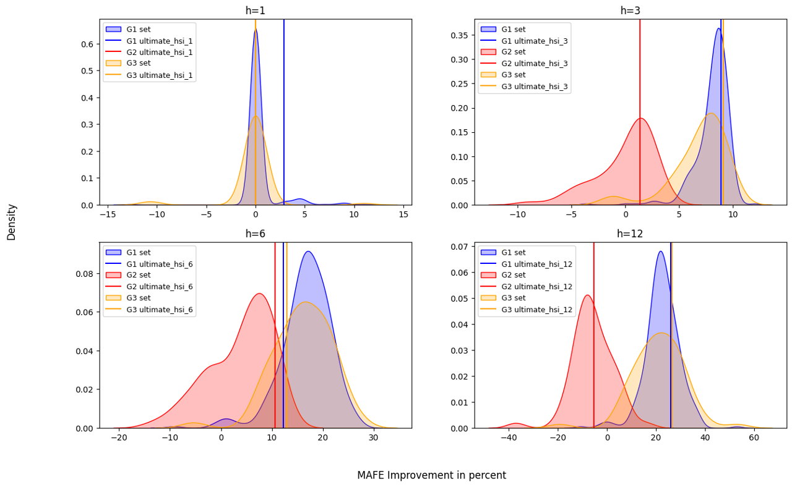
<figcaption><p>Figure 2: KDE distribution of MAFE improvements for all
forecast horizons</p></figcaption>
</figure>

This Kernel Density Estimation (KDE) plot illustrates the distribution
of MAFE improvement percentages relative to the base model at all
forecast horizons for three groups of data: relevant keywords (blue),
irrelevant keywords (red), and a combination of relevant and irrelevant
keywords (orange). The figure shows the MAFE improvement distributions
for the HSIs in the $B_{h}$ set, along with vertical lines representing the
MAFE improvement associated with the UHSIs for each group. The results
indicate that the distributions for the relevant keywords group and the
combination of relevant and irrelevant keywords group are similar, both
showing distinct patterns compared to the irrelevant keywords group,
which demonstrates a notably different distribution.

**MSFE Improvement of HSIs in $B_h$ sets**

``` python
plot_improvement([G1_rel, G2_irr, G3_full], measure='MSFE')
```

<figure>
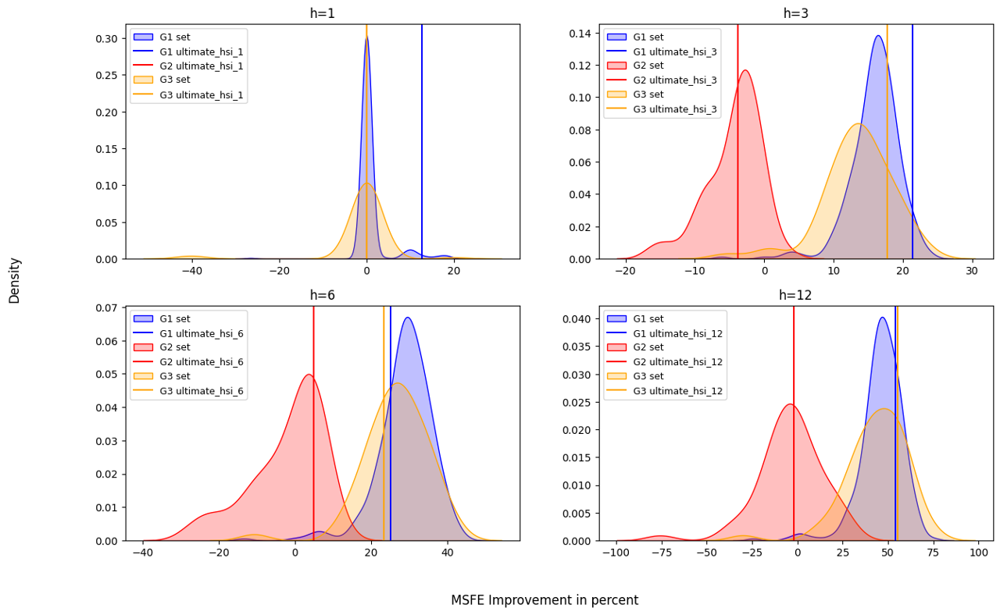
<figcaption><p>Figure 3: KDE distribution of MSFE improvements for all
forecast horizons</p></figcaption>
</figure>

This Kernel Density Estimation (KDE) plot illustrates the distribution
of MSFE improvement percentages relative to the base model at all
forecast horizons for three groups of data: relevant keywords (blue),
irrelevant keywords (red), and a combination of relevant and irrelevant
keywords (orange). The figure shows the MSFE improvement distributions
for the HSIs in the $B_{h}$ set, along with vertical lines representing the
MSFE improvement associated with the UHSIs for each group. The results
indicate that the distributions for the relevant keywords group and the
combination of relevant and irrelevant keywords group are similar, both
showing distinct patterns compared to the irrelevant keywords group,
which demonstrates a notably different distribution.
